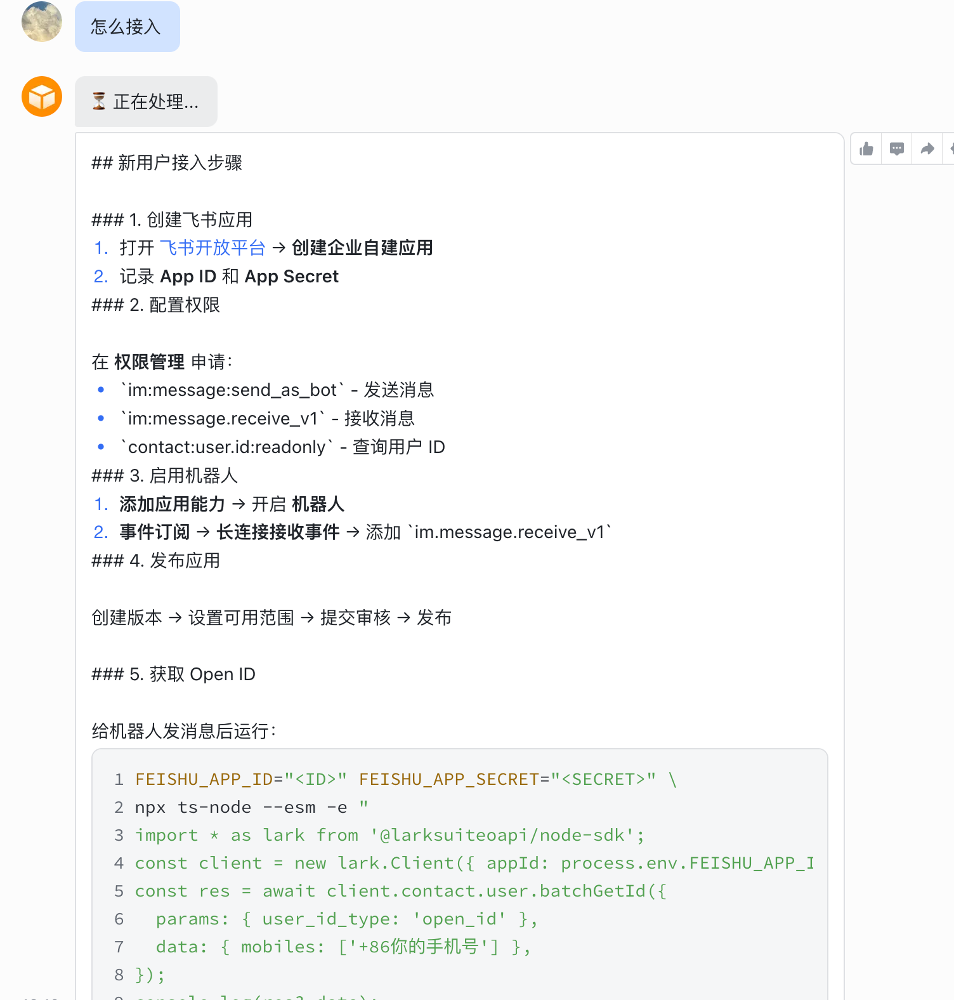
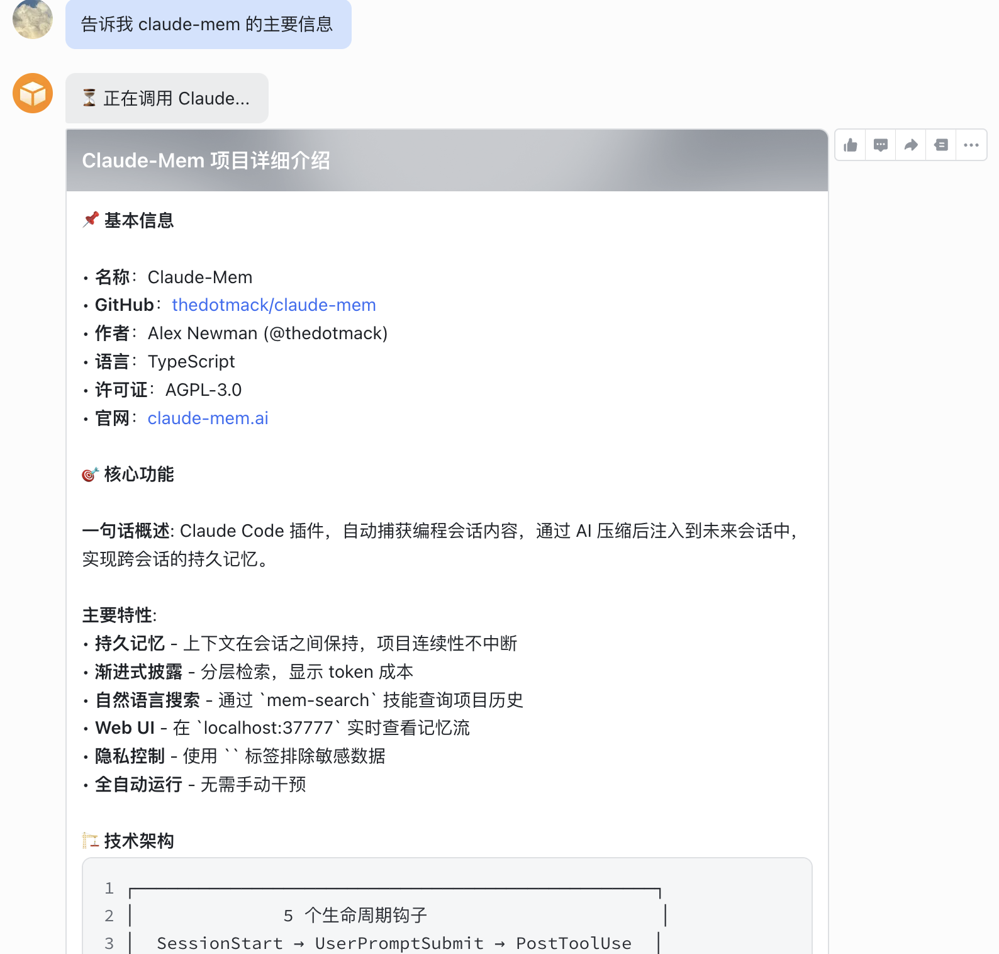
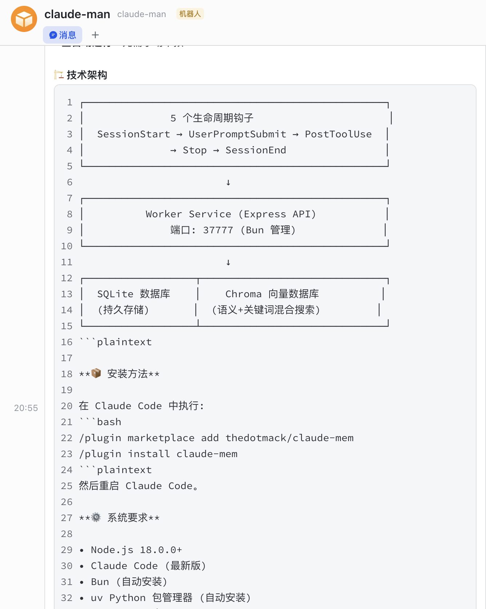

# Feishu-Claude Bridge

让 [Claude Code](https://docs.anthropic.com/en/docs/claude-code) 与[飞书](https://www.feishu.cn/)双向通信，支持两种运行模式。

## 使用场景

### 随时掌握技术趋势

在通勤或休息时，通过飞书让 Claude 帮你追踪 GitHub 热门项目、技术动态：



### 快速了解项目详情

对某个项目感兴趣？直接让 Claude 帮你调研，获取项目介绍、核心特性、技术栈等信息：



### 获取技术架构与安装指南

需要深入了解一个项目？Claude 可以帮你分析技术架构、查看安装方法：



---

## 两种模式

| | MCP Server 模式 | Agent 服务模式 |
|------|----------------|---------------|
| **方向** | Claude → 飞书 | 飞书 → Claude |
| **场景** | 在电脑前使用 Claude Code，让它通过飞书通知你或向你提问 | 不在电脑前，通过飞书远程指挥 Claude 执行任务 |
| **运行方式** | Claude Code 子进程，按需启动 | 独立后台服务，持续运行 |
| **典型用途** | 长任务进度通知、需要人工确认的决策点 | 移动端触发代码修改、远程执行命令 |
| **消息类型** | 文字 | 文字、文件、图片、富文本、飞书文档链接 |

- **选 MCP Server**：你主要在电脑前工作，希望 Claude 在需要时能联系你
- **选 Agent 服务**：你希望随时随地通过手机给 Claude 下达指令，支持发送文件/图片/文档链接
- 两种模式可以同时使用，通过 IPC（Unix Domain Socket）协调通信，共用同一个飞书应用

---

## 前置条件

### 1. 创建飞书自建应用

> 已有飞书应用可跳过此节。

1. 打开[飞书开放平台](https://open.feishu.cn/app)，点击 **创建企业自建应用**
2. 填写应用名称（如 `Claude Bridge`），选择图标，点击创建
3. 记录 **App ID** 和 **App Secret**

### 2. 配置应用权限

进入应用的 **权限管理** 页面，申请以下权限：

**基础权限（必须）：**

| 权限 | 用途 |
|------|------|
| `im:message:send_as_bot` | 以机器人身份发送消息 |
| `im:message.receive_v1` | 接收用户发送的消息事件 |
| `contact:user.id:readonly` | 通过手机号/邮箱查询用户 Open ID |

**文件与文档权限（推荐）：**

| 权限 | 用途 |
|------|------|
| `im:resource` | 下载消息中的文件和图片资源 |
| `docx:document:readonly` | 读取飞书文档内容 |
| `wiki:wiki:readonly` | 读取飞书知识库文档 |

> 不开启文件与文档权限时，文件/图片/文档链接相关功能不可用，其他功能正常。

### 3. 启用机器人能力 & 事件订阅

1. 进入 **添加应用能力**，开启 **机器人** 能力
2. 进入 **事件订阅** 页面：
   - 订阅方式选择 **使用长连接接收事件**（无需公网 IP）
   - 添加事件：`im.message.receive_v1`（接收消息）

### 4. 发布应用

1. 进入 **版本管理与发布**，创建一个新版本
2. 设置好可用范围，提交审核并发布
3. 发布后，在飞书中搜索机器人名称，确认可以找到

### 5. 获取你的 Open ID

在飞书中给机器人发一条消息后，运行以下脚本查询：

```bash
FEISHU_APP_ID="<YOUR_APP_ID>" \
FEISHU_APP_SECRET="<YOUR_APP_SECRET>" \
npx ts-node --esm -e "
import * as lark from '@larksuiteoapi/node-sdk';
const client = new lark.Client({ appId: process.env.FEISHU_APP_ID!, appSecret: process.env.FEISHU_APP_SECRET! });
const res = await client.contact.user.batchGetId({
  params: { user_id_type: 'open_id' },
  data: { mobiles: ['+86你的手机号'] },
});
console.log(JSON.stringify(res?.data, null, 2));
"
```

> 需要应用已开通 `contact:user.id:readonly` 权限。

---

## 安装

### 一键安装（推荐）

安装脚本会自动完成环境检查、依赖安装、项目编译、飞书凭据配置，并可选配置 MCP 飞书通知。

**macOS / Linux：**

```bash
git clone https://github.com/anthropics/feishu-claude-bridge.git
cd feishu-claude-bridge
./install.sh
```

**Windows：**

```bat
git clone https://github.com/anthropics/feishu-claude-bridge.git
cd feishu-claude-bridge
install.bat
```

**安装参数：**

| 参数 | 说明 |
|------|------|
| `-g` / `--global` | MCP 配置写入全局 `~/.claude/settings.json`（默认写入项目级） |
| `-y` / `--yes` | 跳过确认提示，使用默认值 |
| `-h` / `--help` | 显示帮助信息 |

### 手动安装

```bash
git clone https://github.com/anthropics/feishu-claude-bridge.git
cd feishu-claude-bridge
npm install
npm run build
cp .env.agent.example .env.agent
# 编辑 .env.agent，填入飞书凭据
```

---

## 启动

### 使用启动脚本（推荐）

**macOS / Linux：**

```bash
./start.sh              # 启动 Claude Code + 飞书 MCP 集成（默认）
./start.sh agent        # 启动 Agent 服务（飞书 → Claude）
./start.sh mcp          # 启动 MCP Server（调试用）
./start.sh --kill-agent # 先停止 Agent，再启动 Claude Code
```

**Windows：**

```bat
start.bat               REM 启动 Claude Code + 飞书 MCP 集成（默认）
start.bat agent         REM 启动 Agent 服务（飞书 → Claude）
start.bat mcp           REM 启动 MCP Server（调试用）
```

**启动参数：**

| 参数 | 说明 |
|------|------|
| `claude`（默认） | 启动 Claude Code，自动配置飞书 MCP 集成 |
| `agent` | 启动 Agent 服务（飞书 → Claude），支持文件/图片/文档接收 |
| `mcp` | 启动 MCP Server 独立模式（调试用） |
| `--kill-agent` | 启动前先停止运行中的 Agent 服务 |
| `-h` / `--help` | 显示帮助信息 |

> 启动脚本会自动检测 `dist/` 是否存在，不存在会自动编译。

### 手动启动

```bash
# Agent 服务
npm run agent

# MCP Server
npm start
```

---

## Agent 服务

Agent 服务使用本地 `claude` CLI 执行任务，通过飞书接收指令并返回结果。

### 前置条件

```bash
# 安装 Claude Code CLI
curl -fsSL https://claude.ai/install.sh | bash

# 登录
claude login
```

> **无需 ANTHROPIC_API_KEY**：直接使用 Claude Code 订阅，不需要单独的 API Key。

### 使用方式

启动后在飞书中给机器人发消息即可对话。

**支持的消息类型：**

| 消息类型 | 说明 |
|---------|------|
| 📝 文字消息 | 直接对话，支持斜杠命令 |
| 📁 文件消息 | 发送 PDF/DOCX/TXT 等文件，Claude 自动下载并读取内容 |
| 📷 图片消息 | 发送图片，Claude 自动下载并识别图片内容 |
| 📝 富文本消息 | 带格式的文字和嵌入图片，自动提取文字并下载图片 |
| 📄 飞书文档链接 | 发送飞书文档/知识库链接，Claude 通过 API 直接读取文档内容 |

> 文件和图片下载需要 `im:resource` 权限；文档读取需要 `docx:document:readonly` 权限；知识库文档还需要 `wiki:wiki:readonly` 权限。

**支持的命令：**

| 命令 | 功能 |
|------|------|
| `/new` | 清除会话上下文，开始新对话 |
| `/cancel` | 取消当前正在执行的任务 |
| `/status` | 查看当前会话状态 |
| `/help` | 显示帮助信息 |

**Claude 可执行的操作：** 读取和编辑代码文件、执行终端命令、搜索代码库、访问网页信息。

---

## MCP Server

MCP Server 让 Claude Code 能主动通过飞书联系你。安装脚本已支持自动配置，也可手动配置。

### 手动配置

在 `~/.claude/settings.json`（全局）或项目 `.claude/settings.json` 中添加：

```json
{
  "mcpServers": {
    "feishu-bridge": {
      "command": "node",
      "args": ["dist/index.js"],
      "cwd": "/absolute/path/to/feishu-claude-bridge",
      "env": {
        "FEISHU_APP_ID": "<YOUR_APP_ID>",
        "FEISHU_APP_SECRET": "<YOUR_APP_SECRET>",
        "FEISHU_USER_ID": "<YOUR_OPEN_ID>"
      }
    }
  }
}
```

### 验证

重启 Claude Code，输入：

```
请用 feishu_notify 给我发一条消息："配置测试成功"
```

### MCP 工具

| 工具 | 说明 |
|------|------|
| `feishu_notify` | 发送飞书通知（不等待回复） |
| `feishu_ask` | 发送问题并等待用户在飞书上回复 |
| `feishu_history` | 查询最近的消息交互历史 |

---

## 环境变量

### 通用

| 变量 | 必填 | 说明 |
|------|------|------|
| `FEISHU_APP_ID` | 是 | 飞书应用 App ID |
| `FEISHU_APP_SECRET` | 是 | 飞书应用 App Secret |
| `FEISHU_USER_ID` | 否 | 默认目标用户 Open ID |
| `LOG_LEVEL` | 否 | 日志级别：`debug` / `info` / `warn` / `error`，默认 `info` |

### Agent 专用

| 变量 | 必填 | 说明 |
|------|------|------|
| `AGENT_WORKING_DIR` | 否 | 工作目录，默认当前目录 |
| `AGENT_MODEL` | 否 | 使用的模型，默认 `claude-opus-4-5-20251101` |
| `AGENT_CLAUDE_PATH` | 否 | Claude CLI 路径，默认 `claude` |
| `AGENT_PERMISSION_MODE` | 否 | 权限模式：`acceptEdits` / `plan` / `bypassPermissions` |
| `AGENT_MAX_BUDGET_USD` | 否 | 单次任务预算上限，默认 `1.0` |
| `AGENT_ALLOWED_TOOLS` | 否 | 允许的工具列表，逗号分隔 |
| `AGENT_ALLOWED_USERS` | 否 | 允许使用的用户 Open ID，逗号分隔 |
| `AGENT_SESSION_TIMEOUT_MS` | 否 | 会话超时时间（毫秒），默认 24 小时 |
| `AGENT_SESSION_PERSIST_PATH` | 否 | 会话持久化文件路径 |

完整配置示例见 `.env.agent.example`。

---

## 部署

### Docker

```bash
claude login                    # 确保本机已登录
cp .env.agent.example .env.agent  # 配置飞书凭据
docker-compose up -d            # 启动（自动挂载 ~/.claude 凭据）
docker-compose logs -f          # 查看日志
```

### Systemd（Linux）

```bash
sudo bash deploy/install.sh
sudo systemctl start feishu-claude-agent
```

---

## 架构

```
┌──────────────┐     IPC (Unix Socket)     ┌──────────────┐
│  MCP Server  │◄─────────────────────────►│ Agent 服务    │
│ (Claude子进程) │                           │ (独立后台进程)  │
└──────┬───────┘                           └──────┬───────┘
       │                                          │
       │ stdio                             WebSocket
       │                                          │
┌──────┴───────┐                           ┌──────┴───────┐
│  Claude Code │                           │   飞书服务器   │
└──────────────┘                           └──────────────┘
```

- **MCP Server** 通过 stdio 与 Claude Code 通信，提供 `feishu_notify` / `feishu_ask` / `feishu_history` 工具
- **Agent 服务** 通过飞书 WebSocket 长连接接收消息，调用本地 `claude` CLI 执行任务
- 两者通过 **IPC（Unix Domain Socket）** 协调：当 Agent 持有 WebSocket 连接时，MCP 的 `feishu_ask` 请求通过 IPC 转发给 Agent 执行
- 文件/图片通过飞书消息资源 API 下载到本地临时目录，由 Claude 读取
- 飞书文档通过 `docx.document.rawContent` API 直接获取纯文本内容

---

## 开发

```bash
npm test         # 运行测试
npm run build    # 构建
```

## License

[MIT](LICENSE)
